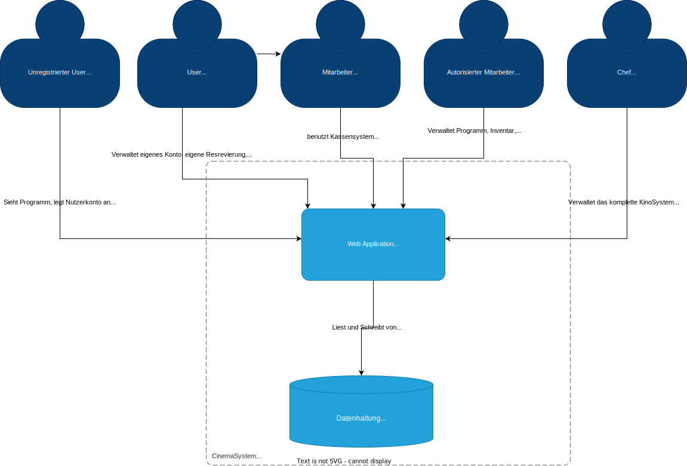
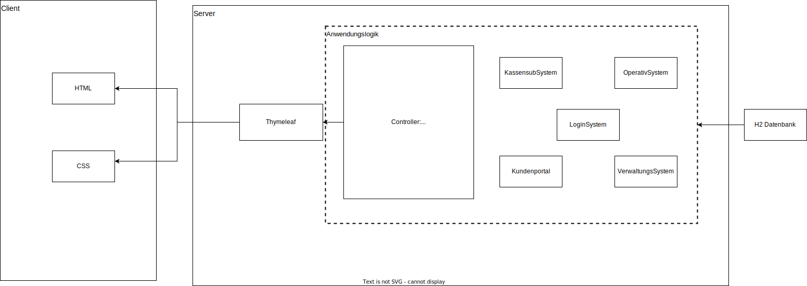

= Entwicklerdokumentation
:project_name: Kinosystem UFO
:toc: left
:toc-title: Inhaltsverzeichnis
:numbered:

[options="header"]
[cols="1, 3, 3"]
|===
|Version | Bearbeitungsdatum   | Autor 
| 0.2    | 05.05.2024          | Jannik
| 0.3    | 13.05.2025          | Jannik, Yannick, Tobias
|===

== Einführung und Ziele
=== Zieldefinition

Ziel dieser neuen webbasierten Kino-Allrounder-Software ist es, sowohl die Arbeitsprozesse der Mitarbeiter, autorisierten Mitarbeiter und des Bosses zu erleichtern, sowie als auch den Komfort und die Flexibilität der Kunden zu fördern. Die klassischen Vorgänge des ausschließlichen Vorort-Services, sowie die unübersichtliche, zeitintensive und nicht immer aktuelle Pflege von Ordner-Papier-Dokumenten für die Verwaltung, Organisation und strategische Planung sollen durch diese Software ersetzt und durch die Automatisierung für alle beteiligten Personen erleichtert werden.

In unserem Kino-System UFO spielen zum einen die Kunden (Customer) eine wesentliche Rolle. Diese können jederzeit über diese Anwendung über das Web sich das aktuelle Kinoprogramm  anzeigen lassen und nach Belieben bequem z.B. von Zuhause aus sich Plätze (Seat)s für eine kommende Veranstaltung (CinemaShow)s reservieren (Reservation) und diese dann vor Ort bis 30min vor der Veranstaltung kaufen.

Das System beinhaltet allerdings noch weitere Rollen (User), welche alle relational aufeinander aufbauen, was so viel bedeutet wie, jede Rolle mit einem höheren Status erlangt zusätzlich zu allen Rechten der unteren Rolle, weitere Rechte, um mit dem Kinosystem zu interagieren.

Als Erstes haben wir da den "normalen" Mitarbeiter, welcher die Verkaufsoberfläche des Systems nutzen kann, um z.B. Karten und Snacks zu verkaufen und Reservierungen vom Kunden (vor Ort / telefonisch) direkt anzulegen.

Dann gibt es den autorisierten Mitarbeiter, welcher neben den Aktionen des "normalen" Mitarbeiters zusätzlich noch Verwaltungsaufgaben im System einsehen, anlegen und ändern kann. Darunter zählt z.B. das Anpassen des Programms, Anbieter vergleichen, Zentrallager verwalten und aktuelle Filmstatistiken einsehen.

Die höchste Rolle besitzt der Chef, dieser kann alle Funktionen des Systems benutzen. Hierbei kommen administrative und operative Systemoptionen hinzu, wie z.B. das externe Vermieten von Sälen, die gesamte Personalverwaltung, das Anpassen von Preisen, sowie das Einsehen von Wirtschaftsdaten (Diagramme in einem Dashboard).

Alle Rollen sind dabei klar voneinander getrennt. Ein unregistrierter Nutzer kann dabei nur sich das Programm anzeigen lassen und sich neu registrieren (erhällt die Rolle des Kunden). Jeder Nutzer-Account besteht aus 3 Datenfeldern: E-Mail, Benutzername, Passwort. Die E-Mail dient dazu, damit ein Nutzer mit böswilligen Absichten sich nicht beliebig viele Nutzer-Accounts erstellt, um das Kino komplett mit Reservierungen auszubuchen. Dabei wird die E-Mail auf Validität geprüft und ebenfalls ob ein starkes Passwort vorhanden ist. Durch eine erfolgreiche Anmeldung erhällt der Nutzer seine jeweilige Rolle im System und dementsprechend die nötigen Rechte, um die aufgeführten UseCases auszuführen, zu können. Alle freigeschalteten Funktionen sind in der Navigationsbar auf der Startseite der Website des Kinos zentral durch Untermenüs aufrufbar. In jedem Untermenü kann eine oder mehrere Aktion(en) durchgeführt werden. Dies kann der Zugang zu Informationen sein, sowie das Editieren und Konfigurieren von aktuellen Geschehnissen im Kino. Zum Schutz vor unbefugtem Zugriff aus das System wird eine Nutzer-Session nach einer gewissen Zeit geschlossen und der Nutzer muss sich erneut anmelden.

Zusammenfassend soll eine solide, sichere, erweiterbare, zentrale webbasierte Kino-Allrounder Software entstehen, welche mehr Kunden anlocken soll und den Arbeitsaufwand des Personals und des Chefs verringern soll.

=== Qualitätsanforderungen

Um die Qualität der Software beurteiln zu können, wurden die folgenden, durch die Software zu erfüllenden, Qualitätsmerkmale definiert:
Hinweis: Die nachfolgenden Erläuterungen wurden von https://iso25000.com/index.php/en/iso-25000-standards/iso-25010[ISO/IEC 25010 Software Quality Model^] und https://github.com/HOME-programming-pub/videoshop/blob/2aa60ddfa2ead70c23d8a655ff0f748e1fbec330/src/main/asciidoc/developer_documentation.adoc[HOME-programming-pub/videoshop] adaptiert.

Wartbarkeit::
Wartbarkeit bezeichnet den Grad an Effizienz, mit derer das System verbessert, korrigiert oder an neue Umgebungsbedingungen angepasst werden kann.

Nutzbarkeit::
Grad, zu dem das System durch die einzelnen Nutzergruppen effizient zum jeweiligen Nutzungszweck genutzt werden kann

Sicherheit::
Grad, zu derer das System Informationen, insbesondere personenbezogenen Daten, denjenigen Personden oder Systemen zeigt, die dafür autorisiert sind, und vor denjenigen verbirgt, die nicht autorisiert sind.

Die nachfolgende Tabelle zeigt die Qualitätsmerkmale sowie deren Wichtigkeit.
Die erste Spalte gibt den Namen des Qualitätsziels an, während in den Verbleibenden Spalten die Priorität durch dass
Vorhandensein einex "X" ausgewiesen wird. 1 entspricht einem Qualitätsmerkmal, das unwichtig ist, 5 einem, dass sehr wichtig ist.

[options="header", cols="3h, ^1, ^1, ^1, ^1, ^1"]
|===
|Quality Demand           | 1 | 2 | 3 | 4 | 5
|Wartbarkeit              |   |   |   |   | X
|Nutzbarkeit              |   |   |   | X | 
|Sicherheit               |   |   |   | X |
|===

Im folgenden werden die Merkmale näher beleuchtet.

==== Wartbarkeit
Das zu entwickelnde System muss hochgradig wartbar sein, da bei einer Kinokette der Größe der UFO Kinos davon auszugehen ist, 
das dass System mehrere Jahre, vielleicht Jahrzehnte, in Benutzung sein wird. Hinzu kommt, dass Ausfälle im Produktiveinsatz schnell
teuer werden können, wenn die Kasse streikt und daher kein Kartenverkauf möglich ist.

==== Nutzbarkeit
Das System muss einfach sowohl für Kunden als auch für Mitarbeiter zu bedienen sein. Einschränkungen in der Bedienbarkeit führen bei Kunden in erster Linie dazu, das sie Aufgaben an Mitarbeiter delegieren, oder aber auch, dass sie einfach versuchen, spontan an der Kasse karten zu kaufen, was möglicherweise nicht mehr rechzeitig vor Beginn geschehen kann. Auf Mitarbeiterseite führt eine schlechte Nutzbarkeit i erster Linie zu einer geringeren mittleren Rate an Aktionen (Reservierungen, Verkäufen) pro Zeit bzw. längeren Einzelaktionen (Programm festlegen, Säle Vermieten, Effektivität einer Veränderung in der Häufigkeit eines Films beurteilen). Schlimmstenfalls drohen Wirtschaftseinbußen, wenn bspw. Leute nicht rechtzeitig ihre Karten erwerben können oder jemand Snacks mit natürlich oder gesetzlich bedingter maximaler Lagerdauer in falscher Quantität bestellt.

==== Sicherheit
Das System muss robust sein, da ein Ausfall während der Geschäftszeit Geldeinbußen für das Kino durch nicht verkaufbare Karten bedeutet.
Zudem würde ein Ausfall die Kundschaft verärgern, die damit möglicherweise zur Konkurrenz abwandern. Hinzu kommen durch die Speicherung
von E-Mail-Adressen Verpflichtungen durch die Datenschutz-Grundverordnung sowie ein möglicher Imageschaden für das Kino im Falle eines 
Datenlecks, insbesondere wenn sich die Art der Passwortspeicherung als unzulänglich herausstellen sollte.

== Randbedingungen
=== Hardware Spezifikationen
Eine Liste der erforderlichen Geräte/Hardware zur Ausführung und Verwendung der Anwendung.

- Server
- Computer
- Tastatur
- Maus

=== Software Spezifikationen
Eine Liste der erforderlichen Software zur Ausführung und Verwendung der Anwendung.

Für die Ausführung der Anwendung ist die folgende (oder neuere) Java-Version erforderlich:

- Java 22

Zur Verwendung der Anwendung sind die folgenden (oder neuere) Browser-Versionen erforderlich:

- Edge 124.0
- Firefox 125.0
- Google Chrome 126.0
- Opera 109.0

=== Produktnutzung
Das System wird als eine Komplettlösung für eine Kinobetriebsgesellschaft genutzt. Diese enthält Teilsysteme zur Verwaltung, ein Kassensubsystem für den Verkauf sowie ein Kundenportal für Kunden. Diese Software wird von der Kinobetreibergesellschaft UFO in all ihren Standorten eingesetzt. Sie soll auf einem Server laufen und ist über das Internet (via Browser) für interessierte Kunden und der Kinobetreibergesellschaft UFO erreichbar.

Das Kundenportal kann intuitiv von Kunden genutzt werden, da sie das Navigationslayout einer typischen Webseite besitzt.
Das Kassensubsystem und das Verwaltungssystem wird wenig komplex und intuitiv bedienbar sein, wodurch sich die Mitarbeiter und der Chef schnell daran gewöhnen können.

Alle Daten sollen persistent in einer Datenbank gespeichert werden und über die Anwendung zugänglich sein (z.B. sollten Mitarbeiter  keine SQL-Anfragen formulieren müssen)

== Kontextabgrenzung
=== Kontextdiagramm
[[context_diagram_d_c4]]
image::./models/analysis/Kontext/Kontext.svg[Context diagram, 100%, 100%, pdfwidth=100%, title= "Kontextdiagramm des {project_name}", align=center]

== Lösungsstrategie
=== Erfüllung der Qualitätsziele

Die Nachfolgende Tabelle gibt die Lösungsansätze für die Qualitätsanforderungen an. Sie wurde Teilweise von https://github.com/HOME-programming-pub/videoshop/blob/main/src/main/asciidoc/developer_documentation.adoc#architecture-decisions inspiriert.
[options="header"]
|===
|Qualitätsziel |Lösungsansatz
|Wartbarkeit a|
* *Modularität* Die Anwendung wird aus einzelnen Modulen gebaut, sodass Änderungen an einer Stelle sich auf wenige Stellen auswirken.
* *Wiederverwendbarkeit* Einzelkomponenten sollen von andere Systeme weitergenutzt werden können
* *Modifizierbarkeit* Die Anwendung soll ohne Fehler erweitert oder modifiziert werden können.
|Nutzbarkeit a|
* *Learnability* Das System soll für Nutzer einfach zu verstehen sein, etwa durch klare Beschreibungen von Knöpfen und Eingabefeldern.
* *Error handling/Nutzerschutz* Ungültige Eingaben müssen erkannt werden und dürfen nicht zu ungültigen Systemstadien führen.
* *Accessibility* Es muss sichergestellt werden, dass diverse potentiell eingeschränkte Personen das System Nutzen können, etwa durch die verwendung geeigneter Schriftgrößen und Farbkontraste
|Sicherheit a|
* *Geheimhaltung* Das System muss sicherstellen, dass nur solche Personen Zugang zu Informationen bekommen, die dafür auch autorisiert sind. Dies wird mit _Spring Security_ und _Thymeleaf_ (`sec:authorize` - tag) erledigt.
* *Integrität* Das System muss die nicht autorisierte Modifizierung von Daten verhindern. Dies kann mit _Spring Security_ (`@PreAuthorize` - annotation) gemacht werden.
|===

=== Softwarearchitektur
* Beschreibung der Architektur anhand der Top-Level-Architektur oder eines Client-Server-Diagramms

[[SoftwareArchitektur_diagram_d_c4]]

[[Client_Server_View]]

=== Entwurfsentscheidungen
==== Verwendete Muster

* Spring MVC

==== Persistenz

Es wird eine H2 Datenbank benutzt, die über Spring Data JPA Java Klassen in die Tabellen verbindet. Persistenz wird über Spring Data JPA sichergestellt.

==== Benutzeroberfläche
[[Nutzerinterface]]
image::./models/design/dialog-flow.drawio.svg[UI-Diagram, 100%, 100%, pdfwidth=100%, title= "UI-Verlauf des Kinosystems", align=center]

Weiße Kästen geben Links oder Knöpfe an, mit denen die Seite gewechselt werden kann. Zur besseren Übersichtlichkeit wurden Links des Navigationsmenüs sowie Seitenneuladende Aktionen (bspw. Ticket hinzufügen) weggelassen.

=== Verwendung externer Frameworks

[options="header"]
|===
|Externe Bibliothek|Kategorie|Beschreibung
|Spring Boot|Allgemeine Nutzung|Funktionen für das MVC System der Anwendung
|Spring Data JPA|Datenanbindung|Hilfe beim Datenzugriff und der Einhaltung der Persistenz
|Salespoint|Allgemeine Nutzung|Allgmeine Funktionen einer MVC Anwendung mit vorgefertigten Strukturen
|Thymeleaf|UserInterface|Darstellungshilfe für HTML 
|===

== Bausteinsicht
=== Package-Diagramm
image::./models/design/dialog-flow.drawio.svg[UI-Diagram, 100%, 100%, pdfwidth=100%, title= "UI-Verlauf des Kinosystems", align=center]

=== Entwurfsklassendiagramme der einzelnen Packages

==== Kassensubsystem

image::./models/design/Kassensubsystem/KlassenDiagramm_Kassensubsystem.svg[Class diagram, 100%, 100%, pdfwidth=100%, title= "Entwurfsklassendiagram", align=center]

[options="header"]
|=== 
|Klasse/Enumeration |Beschreibung
|MakeOrderController | SpringMVC Controller für das Anlegen von Bestellungen und hinzufügen von Tickets und Snacks
| DeleteOrderController | SpringMVC Controller für das Löschen von Bestellungen 
| Order | Modelklasse für Bestellungen
| Ticket | Modellklasse für Tickets
| Snacks |  Modellklasse für Snacks
| Reservation |  Modellklasse für Reservierungen
| SnacksRepository | Repository-Interface zum Verwalten von Snacks
| ReservationRepository | Repository-Interface zum Verwalten von Reservierungen 
| SnackDataInitializer | Implementierung des DataInititializer Interfaces, zum erzeugen von Dummy/Testdaten
|===

==== Kundenportal

image::./models/design/Kundenportal/kundenportal_entwurfsklassendiagram.drawio.svg[Class diagram, 100%, 100%, pdfwidth=100%, title= "Entwurfsklassendiagram", align=center]

[options="header"]
|===
|Klasse/Enumeration |Beschreibung
| DeleteReservationController | Spring MVC-Controller für das Anzeigen und Löschen von Reservierungen
| Film | Modellklasse für Filme
| FilmDataInitialiser | Eine Implementierung des DataInitialiser-Interfaces, um automatisch bei Programmstart Dummy-Daten zu erzeugen
| FilmRepository | Repository-Interface zum Verwalten von Filmen
| IndexController | Spring MVC-Controller für die Startseite (URL-Pfad / ) der Anwendung
| MakeReservationController | Spring MVC-Controller für das Erstellen von Reservierungen
| Reservation | Datenklasse für Reservierungen
| ReservationRepository | Repository-Interface zum Verwalten von Reservierungen
| ViewProgramController | Gemeinsamer Spring MVC-Controller mit dem Operativsystem zum Anzeigen und ändern des Programms
|===

==== Verwaltungssystem

image::./models/design/Verwaltungssystem/verwaltung_klasse.drawio.svg[Class diagram, 100%, 100%, pdfwidth=100%, title= "Entwurfsklassendiagramm des Verwaltungssystem", align=center]

[options="header"]
|===
|Klasse/Enumeration |Beschreibung
| CinemaHall | Modellklasse für Kino-Säle
| CinemaHallRepository | Repository-Interface zum Verwalten von Kino-Sälen
| CinemaShow | Modellklasse für Kino-Vorführungen
| CinemaShowDayEntry | Meta-Klasse, welche alle Veranstaltungen einer Spielwoche im Kino beinhaltet
| CinemaShowRepository | Repository-Interface zum Verwalten von Kino-Vorführungen
| Film | Modellklasse für Filme
| FilmProvider | Modellklasse für Film-Anbieter
| FilmProviderRepository | Repository-Interface zum Verwalten von Film-Anbietern
| FilmRepository | Repository-Interface zum Verwalten von Filmen
| ManageStorageController | SpringMVC Controller für das Anzeigen, Anlegen und Bearbeiten (hinzufügen und entfernen) von Items (aktuell nur Snacks) im Lager des Kinos
| RentFilmController | SpringMVC Controller für das Anzeigen von aktuell geliehenen Filmen, die Verlängerung der Film-Leihe, Anzeigen von neuen verfügbaren Filmen und die Möglichkeit diese auszuleihen.
| Seat | Modellklasse für Plätze
| SnacksRepository | Repository-Interface zum Verwalten von Snacks
| ViewProgramController | SpringMVC Controller für das Anzeigen des (aktuellen) Kinoprogramms (wochenweise) und das Hinzufügen von neuen Kino-Vorführungen
|===

==== Operativsystem

image::./models/design/Operativsystem/Entwurfsklassendiagramm/Operativsystem_Entwurfsklassendiagramm.svg[Class diagram, 100%, 100%, pdfwidth=100%, title= "Entwurfsklassendiagramm des Operativsystems", align=center]
[options="header"]
|===
|Klasse/Enumeration |Beschreibung
|Event |Eine Klasse für alle externen Events die in gemieteten Kinosälen stadtfinden können
|EventDataInitializer |Eine Implementation des DataInitializer, der Event Testdaten beim Starten des Programms erzeugt
|EventAdministrationController |Ein Spring MVC Controller, der Veranstaltungen auflisten und Events hinzufügen kann
|BusinessDataDashboardController |Ein Spring MVC Controller, der auf Anfrage ein Dashboard mit Wirtschaftsdaten sendet
|PriceAdjustController |Ein Spring MVC Controller, der ees ermöglicht Preise und Rabattierung anzupassen
|StaffManageController |Ein Spring MVC Controller mit dem man Mitarbeiterkonten anzeigen, erstellen und bearbeiten kann
|EventRepository |Eine Implementation eines GRUD-Interfaces, dass Event Daten verwaltet
|===

==== Loginsystem

[options="header"]
|===
|Klasse/Enumeration |Beschreibung
|DeleteReservationController |Spring MVC-Controller für das Anzeigen und Löschen von Reservierungen

|Film |Modellklasse für Filme

|FilmDataInitialiser
|Eine Implementieruung des DataInitialiser-Interfaces, um automatisch bei Programmstart Dummy-Daten zu erzeugen

|FilmRepository
|Repository-Interface zum Verwalten von Filmen

|IndexController
|Spring MVC-Controller für die Startseite (URL-Pfad / ) der Anwendung

|MakeReservationController
|Spring MVC-Controller für das Erstellen von Reservierungen

|Reservation
|Datenklasse für Reservierungen

|ReservationRepository
|Repository-Interface zum Verwalten von Reservierungen

|ViewProgramController
|Gemeinsamer Spring MVC-Controller mit dem Operativsystem zum Anzeigen und ändern des Programms
|===

=== Rückverfolgbarkeit zwischen Analyse- und Entwurfsmodell
_Die folgende Tabelle zeigt die Rückverfolgbarkeit zwischen Entwurfs- und Analysemodell._

[options="header"]
|===
|Klasse/Enumeration (Analysemodell) |Klasse/Enumeration (Entwurfsmodell)
|Bestellung   |MakeReservationController, DeleteReservationController
|CinemaHall   |MakeReservationController, DeleteReservationController
|CinemaShow   |ViewProgrammController
|Event        |EventAdministrationController
|Film         |RentFilmController
|FilmProvider |RentFilmController
|Reservation  |MakeReservationController, DeleteReservationController
|Seat         |MakeReservationController
|Snacks       |ManageStorage
|Ticket       |MakeReservationController, DeleteReservationController
|UserEntry    |LoginController.
|===

== Laufzeitsicht
* Darstellung der Komponenteninteraktion anhand eines Sequenzdiagramms, welches die relevantesten Interaktionen darstellt.

=== Kassensubsystem
image::./models/design/Kassensubsystem/SequenzDiagramm_Kassensubsystem.svg[Sequenz diagram, 100%, 100%, pdfwidth=100%, title= "Sequenzdiagramm des Kassensubsystem für die MakeOrderController-Funktionen", align=center]

=== Kundenportal
image::./models/design/Kundenportal/kundenportal_sequenzdiagram.drawio.svg[Sequenz diagram, 100%, 100%, pdfwidth=100%, title= "Sequenzdiagramm des Kundenportals für die MakeReservationController-Funktionen", align=center]

=== Verwaltungssystem
image::./models/design/Verwaltungssystem/verwaltung_sequenz_program.drawio.svg[Sequenz diagram, 100%, 100%, pdfwidth=100%, title= "Sequenzdiagramm des Verwaltungssystems für die ViewProgramController-Funktionen", align=center]

image::./models/design/Verwaltungssystem/verwaltung_sequenz_verleih.drawio.svg[Sequenz diagram, 100%, 100%, pdfwidth=100%, title= "Sequenzdiagramm des Verwaltungssystems für die RentFilmController-Funktionen", align=center]

=== Operativsystem
image::./models/design/Operativsystem/Sequenzdiagramm/Operativsystem_Sequenzdiagramm.svg[Sequenz diagram, 100%, 100%, pdfwidth=100%, title= "Sequenzdiagramm des Operativsystems für die Event Controller Funktionen", align=center]
