= Pflichtenheft
:project_name: Kinosystem UFO
== __{project_name}__

[options="header"]
[cols="1, 1, 1, 1, 4"]
|===
|Version | Status      | Bearbeitungsdatum   | Autoren(en) |  Vermerk
|0.1     | In Arbeit   | 01.04.2023          | Autor       | Initiale Version
|0.3     | In Arbeit   | 21.04.2024          | diverse     | Nachtrag Versionierung
|===

== Inhaltsverzeichnis

**<<UC0010>>**

. Zusammenfassung
. Zielsetzung
. Produktnutzung
. Interessengruppen
. Systemgrenze und Top-Level-Architektur
. Anwendungsfälle
. Funktionale Anforderungen
. Nicht-Funktionale Anforderungen
. GUI Prototyp
. Datenmodell
. Akzeptanztestfälle

== 1. Zusammenfassung
Dieses Dokument dient dazu die Grenzen und Parameter des angestrebten Produktes festzustellen und 
die Bedürfnisse an die Software zu fassen. Dazu werden sowohl die Wünsche des Kunden formuliert, als auch die technischen Rahmenbedingen.
Wir unterteilen also in Beschreibungen und Systementwurf. Weiterhin wird aufgegliedert, welche Anwendungsfälle und Funktionen das Zielsystem bedienen soll und wie eine mögliche Ansicht des Systems aussehen kann.

  
== 2. Aufgabenstellung und Zielsetzung
Die Kinobetreibergesellschaft UFO möchte zukünftig aus personalpolitischen Gründen in
allen Kinos eine einheitliche Software für den Kartenverkauf und für Verwaltungsaufgaben
einsetzen. Die Gesellschaft wendet sich an Sie mit der Bitte, eine moderne und
erweiterungsfähige Software zu entwickeln, die mindestens die nachfolgenden
Anforderungen erfüllen muss. +
Im Verkaufsbereich der Kinos können die Kunden Kinokarten kaufen, reservieren und
tauschen. Ein Rückkauf von Karten soll bis zu 30 Minuten vor Beginn des jeweiligen Filmes
ebenfalls möglich sein. Karten können vor Ort, telefonisch oder online reserviert werden und
sind bei Abholung zu bezahlen. Reservierungen werden 30 Minuten vor Beginn der Vorstellung
ungültig. Die Kinokarten sind an einen bestimmten Tag, eine Uhrzeit, einen Film, einen
Kinosaal (Raum), eine Platzgruppe sowie an die Preiskategorie des Kunden (Erwachsener,
Kind, Schwerbehinderter usw.) gebunden und entsprechend preislich ausgewiesen.
Neben dem Verkauf der Kinokarten soll mit der neuen Software das Kinoprogramm durch
autorisierte Personen verwaltet werden. Das beinhaltet die Zusammenstellung des
wöchentlichen Programms, Programmänderungen sowie das Ausleihen der Filme. Dazu kann
UFO aus den Listen verschiedener Verleihfirmen, die für jeden angebotenen Film den Titel,
eine Kurzbeschreibung, die FSK-Freigabe, den Kinostart und die Gesamtlänge enthalten, die
gewünschten Filme auswählen. Die Leihgebühren werden wochenweise berechnet und
betragen derzeit 30% der Einnahmen durch den Film plus einer Grundgebühr, die sowohl von
der Art des Films als auch von seiner Aktualität abhängt. +
Am Ende jeden Tages wird eine Statistik der Tageseinnahmen aufgestellt, eine monatliche
Umsatzermittlung stellt den Einnahmen aus dem Kartenverkauf die Ausgaben für geliehene
Filme und Personalkosten gegenüber. Es sollte auch möglich sein, die Auslastung der
Kinosäle bezogen auf die Filme einzusehen, um die Laufzeit eines Filmes an das Interesse der
Kinobesucher aktuell anzupassen. Wünschenswert wäre auch eine Unterstützung durch die
Software bei der Vermietung der Kinosäle für andere Veranstaltungen. Außerdem möchte der
UFO-Chef zukünftig auch die Personal- und Saalverwaltung sowie die Preisgestaltung mit der
neuen Software erledigen. +
Neben dem Geschäft mit Filmen und Veranstaltungen, ist der Verkauf leckerster Snacks eine
sehr wichtige Einnahmequelle der Kinos. Sie Software soll daher, nach Möglichkeit, den
Bestand und Verkauf in den Kinos, und das Zentrallager unterstützen.

== 3. Produktnutzung
Das System wird als eine Komplettlösung für eine Kinobetriebsgesellschaft genutzt. Diese enthält Teilsysteme zur Verwaltung, ein Kassensubsystem für den Verkauf sowie ein Kundenportal für Kunden. Diese Software wird von der Kinobetreibergesellschaft UFO in all ihren Standorten eingesetzt. Sie soll auf einem Server laufen und ist über das Internet (via Browser) für interessierte Kunden und der Kinobetreibergesellschaft UFO erreichbar.

Das System wird mit folgenden Browsern erreichbar und visuell optimiert sein:

Mozilla Firefox, Version 92.0.1+

Google Chrome, Version 94.0.4606+

Das Kundenportal kann intuitiv von Kunden genutzt werden, da sie das Navigationslayout einer typischen Webseite besitzt.
Das Kassensubsystem und das Verwaltungssystem wird wenig komplex und intuitiv bedienbar sein, wodurch sich die Mitarbeiter und der Chef schnell daran gewöhnen können.

Alle Daten sollen persistent in einer Datenbank gespeichert werden und über die Anwendung zugänglich sein (z.B. sollten Mitarbeiter  keine SQL-Anfragen formulieren müssen)

== 4. Interessensgruppen (Stakeholder)

[options="header", cols="2, ^1, 4, 4"]
|===
|Name
|Priorität (1..5)
|Beschreibung
|Ziele

|Kinobetreibergesellschaft UFO
|5
|Der Hauptkunde dieses Projekts und Nutzer der Verwaltungssysteme und des Kassensystems.
a|
- Einheitliche Systeme für alle Standorte
- Erleichterung bei der Verwaltung und Kartenverkauf
- Zentrales Verwaltungssystem

|Kunden
|4
|Hauptsächliche Nutzer des Kundenportals.
a|
- Angenehme Nutzererfahrung
- Schneller Reservier- und Kaufprozess

|Entwickler
|3
|Personen die das System entwickeln, verantwortlich für die Wartung sind, oder später neue Funktionen implementieren sollen.
a|
- Einfach erweiterbare Anwendung
- geringer Wartungsaufwand

|===

== 5. Systemgrenze und Top-Level-Architektur

=== Kontextdiagramm
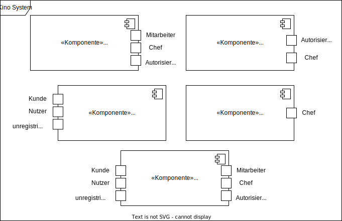
=== Top-Level-Architektur
Top-Level-Architektur:

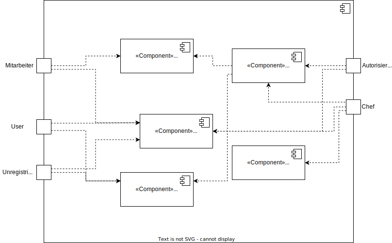

C4 Model:

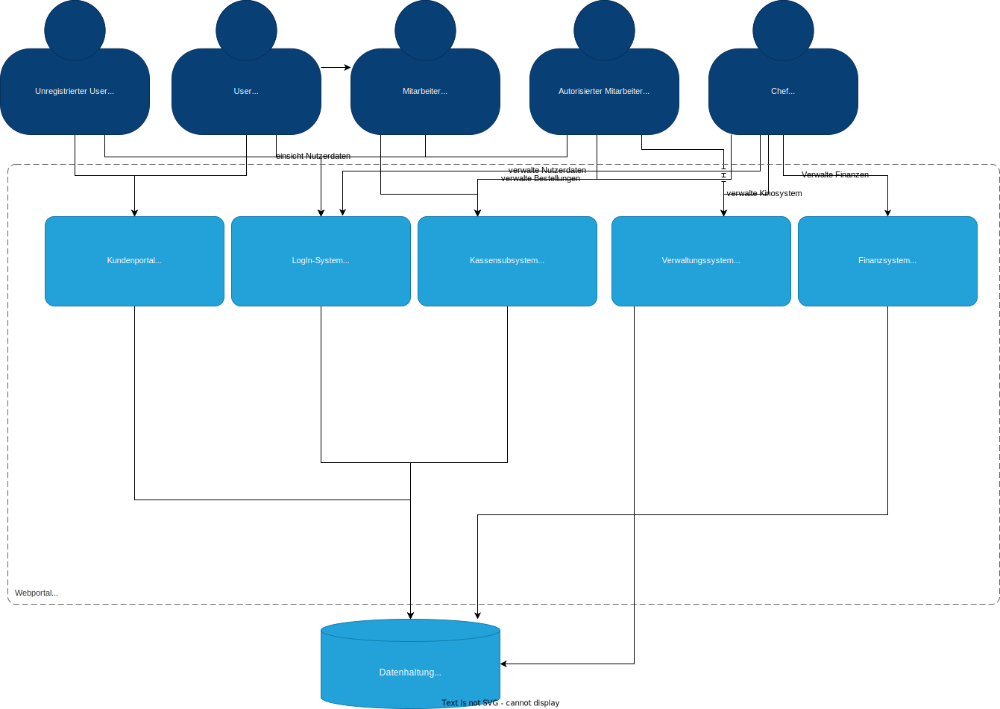

== 6. Anwendungsfälle

In diesem Abschnitt werden die meisten UseCases aufgelistet. Je nach Relevanz der UseCases existieren ausführlichere- und weniger ausführlichere Use-Case-Beschreibungen.

=== Akteure

In der nachfolgenden Tabelle werden alle Akteure aufgelistet und beschrieben, welche direkt auf das System zugreifen. Nutzer welche weitere UseCases an andere Akteure vererben, werden kursiv dargestellt.

[options="header"]
[cols="1,4"]
|===
|Name |Beschreibung
|_unregistrierter Nutzer_  | Repräsentiert jede Person, welche sich auf der Website des Kinos befindet und mit dem System interagiert, ohne einen Nutzer-Account zu besitzen. Diese Person kann die Kinovorschau einsehen und sich registrieren.
|_Nutzer_                  | Repräsentiert jede Person, welche sich auf der Website des Kinos befindet und mit dem System interagiert, schon einen Nutzer-Account zu besitzt und sich jederzeit anmelden kann.
|Kunde                     | Repräsentiert jede registrierte (authentifizierte) Person, welche sich auf der Website des Kinos befindet und mit dem System interagiert und als normale Person (ohne Rechtezuweisung durch den Chef) eingeloggt Reservierungen tätigen kann.
|_Mitarbeiter_               | Repräsentiert vom Chef als Mitarbeiter registrierte (authentifizierte) Personen, welche das Kassensystem des Kinos bedienten können.
|_autorisierter Mitarbeiter_ | Repräsentiert vom Chef als autorisierter Mitarbeiter registrierte (authentifizierte) Personen, welche zusätzlich zum Kassensystem des Kinos auch das Verwaltungssystem bedienen kann.
|Chef                        | Repräsentiert eine einzelne registrierte (authentifizierte) Person, welche neben dem Kassensystem und dem Verwaltungssystem auch das operative System (administrative System) bedienen und steuern kann.
|===

=== Überblick Anwendungsfalldiagramm
image::./models/analysis/UseCase/UseCase.svg[Use Case diagram, 100%, 100%, pdfwidth=100%, title= "Anwendungsfalldiagramm des {project_name}", align=center]

=== Anwendungsfallbeschreibungen

[cols="1h, 3"]
[[UC0010]]
|===
|ID                         |**<<UC0010>>**
|Name                       |Registrieren
|Beschreibung               |Ein unregistrierter Nutzer erstellt sich seinen eigenen Nutzer Account. Er wird dann zum unangemeldeten Nutzer und kann sich einloggen.
|Rollen                     |Unregistrierter Nutzer, unangemeldeter Nutzer
|Auslöser                   |Unregistrierter Nutzer will einen Account beim Drücken auf den "Registrieren"-Button auf der Website erstellen.
|Voraussetzungen           a|Der Nutzer ist nach dem Login noch unangemeldet.
|grundlegende Schritte     a|
1. Unregistrierte Nutzer drückt "Registrieren"-Button auf der Website.
2. Der Nutzer gibt E-Mail, Passwort, Passwort-Bestätigung und Benutzernamen im Formular auf der Website ein.
3. Der Nutzer klickt auf "Registrieren".
4. System prüft, ob Passwort gleich Passwort-Bestätigung.
. wenn gleich: gehe zu Schritt 4.
. sonst: Zeige ein Fehler an.
5. System prüft, ob Benutzername bereits vergeben.
. wenn noch nicht vergeben: gehe zu Schritt 5.
. sonst: Zeige ein Fehler an.
6. System prüft, ob E-Mail-Adresse valide ist.
. wenn valide: erstelle neuen Nutzeraccount und leite Nutzer zur Startseite zurück.
. sonst: Zeige ein Fehler an.

|Erweiterungen              |-
|Funktionale Anforderungen  |<<F0011>>, <<F0012>>
|===

[cols="1h, 3"]
[[UC0020]]
|===
|ID                         |**<<UC0020>>**
|Name                       |Login/Logout
|Beschreibung               |Ein unangemeldeter Nutzer meldet sich auf der Website an, um auf weitere Funktionalitäten Zugriff zu erhalten. Je nach zugeordneter Rolle erteilt das System dem Nutzer nach dem Login entweder die Rolle Kunde, Mitarbeiter, autorisierter Mitarbeiter oder Boss.
Nur der Boss kann explizit über das System die Rollen Mitarbeiter und autorisierter Mitarbeiter einzelnen Nutzer-Accounts vergeben.
Die erweiterte Funktionalität hängt von der vergebenen Rolle ab. Dabei hat jede höhere Rolle Zugriff auf alle Funktionen der niedrigeren Rolle.
Boss > autorisierter Mitarbeiter > Mitarbeiter.
Der Vorgang wird durch das Abmelden, das Schließen der Session oder nach einer gewissen verstrichenen Zeit rückgängig gemacht, sodass der Nutzer wieder die Rolle des unangemeldeten Nutzers erhällt.
|Rollen                     |unangemeldeter Nutzer, Kunde, Mitarbeiter, autorisierter Mitarbeiter, Boss
|Auslöser                   |
_Login_: Unangemeldete Nutzer will sich einlogen, beim Drücken auf den "Login"-Button, um eine erweiterte Funktionalität zu erhalten.

_Logout_: "Angemeldete Nutzer" will sich abmelden, beim Drücken auf den "Logout"-Button.
|Voraussetzungen           a|
_Login_: Nutzer ist noch nicht angemeldet.

_Logout_: Nutzer ist noch nicht abgemeldet.
|grundlegende Schritte     a|
_Login_:

1. Unangemeldete Nutzer drückt auf den "Login"-Button auf der Website.
2. Unangemeldete Nutzer gibt seine Benutzerdaten ein. (Entweder E-Mail und Passwort oder Benutzername und Passwort)
3. Unangemeldete drückt den "Login"-Button.
4. System prüft Benutzerdaten.
. Wenn korrekt: Nutzer wird auf Startseite nun angemeldet weitergeleitet mit der Rolle: Kunde, Mitarbeiter, autorisierter Mitarbeiter oder Boss.
. Sonst: Den Nutzer wird ein Fehler angezeigt.

_Logout_:

1. "Angemeldeter Nutzer" drückt auf den "Logout"-Button auf der Website.
2. Nutzer ist nun abgemeldet und erhällt die Rolle des unangemeldeten Nutzers.

|Erweiterungen              |-
|Funktionale Anforderungen  |<<F0021>>, <<F0022>>
|===

[cols="1h, 3"]
[[UC0110]]
|===
|ID                         |**<<UC0110>>**
|Name                       |Programm anzeigen
|Beschreibung               |Nutzer lässt sich auf der Website das Aktuelle (in naher Zukunft) laufende Kinoprogramm anzeigen.
|Rollen                     |unregistrierter Nutzer, unangemeldeter Nutzer, Kunde, Mitarbeiter, autorisierter Mitarbeiter, Boss
|Auslöser                   |Nutzer will beim Klicken auf den "Programm-Ansicht"-Button sich das aktuelle Kinoprogramm anzeigen lassen.
|Voraussetzungen           a|-
|grundlegende Schritte     a|
1. Der Nutzer klickt auf den "Programm-Ansicht"-Button auf der Website
2. Es öffnet sich eine Unteransicht, in welcher alle zukünftigen Kino-Vorführungen (von oben nach unten, von links nach rechts) angezeigt werden, sortiert nach frühstem Starttermin und frühster Startzeit. Dabei enthält jeder Kino-Vorführungseintrag die nur die wichtigsten Informationen (Filmtitel, Kinosaal, Vorführung-Startdatum- und Zeit, Filmdauer, FSK-Freigabe)
3. Der Nutzer drückt Optional einen Vorführungseintrag an, sodass in einer weiteren Unteransicht noch detailliertere Informationen zur jeweiligen Vorführung angezeigt werden.
4. Der Nutzer klickt den "Zurück"-Button, um von den Unteransichten wieder in die Überansichten zu gelangen.

|Erweiterungen              |-
|Funktionale Anforderungen  |<<F0111>>
|===

[cols="1h, 3"]
[[UC0120]]
|===
|ID                         |**<<UC0120>>**
|Name                       |Online reservieren
|Beschreibung               |Ein Kunde reserviert, bearbeitet Online Tickets für eine Veranstaltung und lässt sich diese anzeigen.
|Rollen                     |Kunde
|Auslöser                   |Kunde will reservieren und klickt auf "Plätze Reservieren"-Button auf der Website.
|Voraussetzungen           a|Der Nutzer muss als Kunde eingeloggt sein.
|grundlegende Schritte     a|
1. Der Kunde klickt auf den "Plätze Reservieren"-Button auf der Website.
2. Es öffnet sich eine Unteransicht, in welcher alle bereits vorhandenen Reservierungen angezeigt werden. Der Kunde lässt sich Reservierungen anzeigen, bearbeitet diese und legt neue Reservierungen an.
3. Der Nutzer drückt "Zurück"-Buttons und gelangt in die vorherigen Überansichten zurück.

_Reservierung-Übersicht_:

Wie in 2. oben beschrieben, werden dem Kunden alle bereits vorhandenen Reservierungen angezeigt (sortiert nach am frühsten stattfindende Veranstaltung). Jeder angezeigte Reservierungs-Eintrag enthält das Reservierungs-Datum, die Reservierungs-Zeit, Reservierung-Nummer, Filmtitel, Kinosaal, finaler Preis und Anzahl reservierter Personen.
Der Kunde klickt weiterhin einen Reservierungs-Eintrag an, um noch detailliertere Informationen zu erhalten (genaue Sitzplatzinformationen und Art der Tickets) und bearbeitet oder löscht Reservierungen.

_Reservierung hinzufügen_:

1. Beim Klicken auf den "Reservierung hinzufügen"-Button durch den Kunden reagiert das System folgendermaßen:
. Wenn die maximal Anzahl an Reservierungen noch nicht erreicht ist: öffnet sich ein "Reservierung hinzufügen"-Untermenü.
. sonst: wird eine Fehlermeldung angezeigt.
2. Der Kunde wählt nun aus dem aktuellen Kinoprogramm eine Vorführung aus.
3. Der Kunde erstellt nun eins oder mehrere neue Tickets aus. Für jedes Ticket wählt der Kunde einen noch nicht belegten Platz in der Veranstaltung und legt die Art des Tickets fest (je nach Person). Er speichert das Ticket über einen "Ticket hinzufügen"-Button.
Für jedes Ticket prüfen:
. Wenn maximale Ticketanzahl noch nicht erreicht: System reserviert Ticket
. Sonst: Kunde erhällt eine Information und es werden keine Änderungen vorgenommen.
4. Der Kunde drückt den "Jetzt reservieren"-Button. Das System speichert die Reservierung und der Kunde gelangt wieder in die allgemeine Reservierung-Ansicht.

_Reservierungen bearbeiten im Reservierungs-Eintrag-Menü_:

- Der Kunde passt die Art der einzelnen Tickets an.
- Der Kunde passt die Platzauswahl der einzelnen Tickets.
. Wenn Plätze frei: Sitzplatzinformationen werden geändert.
. Sonst: Der Kunde erhällt eine Information, das diese Plätze bereits belegt sind und es werden keine Änderungen vorgenommen.
- Der Kunde legt ein oder mehrere Tickets an oder löscht diese.
. Wenn maximale Ticketanzahl noch nicht erreicht und mindestens ein Ticket noch vorhanden ist: System reserviert Tickets oder löscht diese, mit entsprechender wieder Freigabe.
. Sonst: Kunde erhällt eine Information und es werden keine Änderungen vorgenommen.

|Erweiterungen              |-
|Funktionale Anforderungen  |<<F0121>>
|===

image::./models/analysis/Sequenz/sequenz_reservieren.drawio.svg[Use Case diagram, 100%, 100%, pdfwidth=100%, title= "Sequenzdiagramm reservieren", align=center]

[cols="1h, 3"]
[[UC0130]]
|===
|ID                         |**<<UC0130>>**
|Name                       |Online Stornieren
|Beschreibung               |Ein Kunde storniert eine bereits erstellte Reservierung.
|Rollen                     |Kunde
|Auslöser                   |Kunde will einen eine Reservierung Stornieren, durch das Klicken auf den "Reservierung-Stornieren"-Button im Reservierungs-Eintrag-Menü.
|Voraussetzungen           a|Der Nutzer muss als Kunde eingeloggt sein und mindestens eine Reservierung erstellt haben, um diese stornieren zu können.
|grundlegende Schritte     a|
1. Der Kunde klickt auf den "Reservierungen"-Button auf der Website.
2. Der Kunde klickt eine ausgewählte Reservierung an und gelangt in das Reservierungs-Eintrag-Menü der Reservierung.
3. Der Kunde klickt auf den "Reservierung-Stornieren"-Button im Menü, das System öffnet ein Stornieren Bestätigung-Pop-up-Fenster.
4. Der Kunde bestätigt den Vorgang des Stornierens, durch das Klicken auf den "Fortfahren"-Button. Der Kunde gelangt nun wieder zurück in die allgemeine Reservierungs-Übersicht. Das System löscht die Reservierung und gibt alle Tickets der jeweiligen Veranstaltung wieder frei.

|Erweiterungen              |-
|Funktionale Anforderungen  |-
|===

[cols="1h, 3"]
[[UC0210]]
|===
|ID                         |**<<UC0210>>**
|Name                       |vor Ort/telefonisch reservieren
|Beschreibung               |Ein Mitarbeiter legt für eine Person eine Reservierung an.
|Rollen                     |Mitarbeiter, Person
|Auslöser                   |Die Person will den Mitarbeiter persönlich nach einer Reservierung fragen. Der Mitarbeiter muss dann auf "Mitarbeiter reserviert für Kunde"-Button klicken.
|Voraussetzungen           a|Die Person fragt persönlich beim Mitarbeiter an (vor Ort oder telefonisch). Der Mitarbeiter muss im System die Rolle des Mitarbeiters besitzen (durch vorheriges entsprechendes Login, wenn aktuell unangemeldeter Nutzer).
|grundlegende Schritte     a|
1. Person fragt den Mitarbeiter (vor Ort oder telefonisch) nach einer Reservierung. Der Mitarbeiter klickt auf den "Mitarbeiter reserviert für Kunde"-Button. Das System öffnet ein Untermenü, welches ein Formular für eine neue Reservierung bereitstellt.
2. Der Mitarbeiter sucht im aktuellen Kinoprogramm nach der gewünschten Vorführung (Film, Datum und/oder Uhrzeit) und wählt die gewünschte Vorführung der Person aus.
3. Der Mitarbeiter gibt den Kundennamen ein.
4. Der Mitarbeiter fügt Tickets hinzu, durch das Klicken auf den Button "Ticket hinzufügen". Der Mitarbeiter wählt pro Ticket den gewünschten Platz und wählt die Art des Tickets aus. Durch das Drücken auf den "Ticket hinzufügen"-Button:
. wenn Ticketplatz noch nicht vergeben: füge Ticket der Reservierung hinzu.
. sonst: Zeige Information an und Mitarbeiter wählt einen neuen Platz aus.
5. Mitarbeiter speichert nach Zufriedenheit der Person die Reservierung durch das klicken auf den "Reservierung speichern"-Button.

|Erweiterungen              |-
|Funktionale Anforderungen  |-
|===

[cols="1h, 3"]
[[UC0220]]
|===
|ID                         |**<<UC0220>>**
|Name                       |vor Ort/telefonisch stornieren
|Beschreibung               |Ein Mitarbeiter storniert für eine Person eine Reservierung.
|Rollen                     |Mitarbeiter, Person
|Auslöser                   |Die Person will das der Mitarbeiter persönlich eine getätigte Reservierung storniert. Der Mitarbeiter muss dann auf "Mitarbeiter storniert für Kunde"-Button klicken.
|Voraussetzungen           a|Die Person fragt persönlich beim Mitarbeiter an (vor Ort oder telefonisch). Der Mitarbeiter muss im System die Rolle des Mitarbeiters besitzen (durch vorheriges entsprechendes Login, wenn aktuell unangemeldeter Nutzer). Und es muss eine passende Reservierung bereits vorliegen.
|grundlegende Schritte     a|
1. Person gibt den Auftrag an den Mitarbeiter (vor Ort oder telefonisch) eine Reservierung zu stornieren. Der Mitarbeiter klickt auf den "Mitarbeiter storniert für Kunde"-Button. Das System öffnet ein Untermenü, in welchem der Mitarbeiter eine Reservierung suchen kann.
2. Der Mitarbeiter sucht nach einer passenden Reservierung (Name des Kundes, Reservierungsnummer oder Nutzeraccount (Benutzername, E-Mail)).
. Wenn Mitarbeiter die Reservierung findet: Mitarbeiter klickt auf diese. Das System öffnet den Reservierungs-Eintrag.
. sonst: Fehlermeldung
3. Der Mitarbeiter klickt auf den "Reservierung-Stornieren"-Button im Menü, das System öffnet ein Stornieren Bestätigung-Pop-up-Fenster.
4. Der Mitarbeiter bestätigt den Vorgang des Stornierens, nach Vergewisserung beim Kunden, durch das Klicken auf den "Fortfahren"-Button. Das System löscht die Reservierung und gibt die Plätze der Vorführung wieder frei.

|Erweiterungen              |-
|Funktionale Anforderungen  |-
|===

[cols="1h, 3"]
[[UC0230]]
|===
|ID                         |**<<UC0230>>**
|Name                       |Karten verkaufen
|Beschreibung               |Eine Person kauft beim Mitarbeiter Tickets.
|Rollen                     |Mitarbeiter, Person
|Auslöser                   |Person will Karten kaufen. Der Mitarbeiter drückt folglich auf den "Kartenverkauf" Button.
|Voraussetzungen           a|Die Person fragt persönlich beim Mitarbeiter an (vor Ort oder telefonisch). Der Mitarbeiter muss im System die Rolle des Mitarbeiters besitzen (durch vorheriges entsprechendes Login, wenn aktuell unangemeldeter Nutzer).
|grundlegende Schritte     a|
1. Mitarbeiter drückt auf "Kartenverkauf". Das System öffnet eine Unteransicht.
2. Optional: Laden einer Reservierung:
. Der Mitarbeiter gibt die Reservierungs-Nummer oben ein.
. Der Mitarbeiter drückt auf "Reservierung Laden". Wenn Reservierungsnummer vorhanden, so lädt das System die Reservierung und zeigt dies dem Mitarbeiter an. Wenn nicht wird ein Fehler ausgegeben.
3. Der Mitarbeiter kann nun die Kaufvorgangsdaten auswählen oder anpassen (siehe Tickets und Veranstaltung vor Ort auswählen)
4. Der Mitarbeiter kann Optional noch Snacks hinzufügen. (siehe UseCase <<UC0240>>)
5. Mitarbeiter schließt nach Zufriedenheit der Person den Kaufvorgang ab, durch das Klicken auf den "Kaufvorgang abschließen"-Button. Das System öffnet nun eine finale Ansicht, wo noch mal alle Kaufinformationen und der Preis angezeigt wird.
6. Die Person bezahlt und der Mitarbeiter klickt auf "Zahlungsvorgang abschließen". Das System blockt nun die Plätze endgültig, aktualisiert den Lagerbestand, die Umsatzstatistiken und die Filmstatistiken.

_Tickets und Veranstaltung vor Ort auswählen_:

1. Der Mitarbeiter sucht im aktuellen Kinoprogramm nach der gewünschten Vorführung (Film, Datum und/oder Uhrzeit) und wählt die gewünschte Vorführung der Person aus.
2. Der Mitarbeiter drückt auf "Plätze Laden". Das System lädt die aktuelle Ticket-Ansicht der Vorführung.
3. Der Mitarbeiter fügt Tickets hinzu, durch das Klicken auf den Button "Ticket hinzufügen". Der Mitarbeiter wählt pro Ticket den gewünschten Platz und wählt die Art des Tickets aus. Durch das Drücken auf den "Ticket hinzufügen"-Button:
. wenn Ticketplatz noch nicht vergeben: füge Ticket der Reservierung hinzu.
. sonst: Zeige Information an und Mitarbeiter wählt einen neuen Platz aus.

|Erweiterungen              |-
|Funktionale Anforderungen  |<<F0231>>, <<F0232>>, <<F0233>>, <<F0234>>, <<F0235>>
|===

[cols="1h, 3"]
[[UC0240]]
|===
|ID                         |**<<UC0240>>**
|Name                       |Snacks verkaufen
|Beschreibung               |Eine Person kauft beim Mitarbeiter Snacks zusätzlich zu den Kinokarten.
|Rollen                     |Mitarbeiter, Person
|Auslöser                   |Person will noch Snacks kaufen. Der Mitarbeiter drückt folglich auf den Button "Snacks hinzufügen" im Bestell-Prozess.
|Voraussetzungen           a|Die Person fragt persönlich beim Mitarbeiter an (vor Ort oder telefonisch). Der Mitarbeiter muss im System die Rolle des Mitarbeiters besitzen (durch vorheriges entsprechendes Login, wenn aktuell unangemeldeter Nutzer). Ein BestellProzess mit einem Warenkorb muss bereits existieren und der Mitarbeiter befindet sich in dem Menü.
|grundlegende Schritte     a|
1. Mitarbeiter drückt auf "Snacks hinzufügen"-Button im Bestellprozess-Menü. Das System öffnet ein Menü mit allen vorhandenen Snacks, nachdem der Lagerbestand geprüft wurde.
2. Die Person wählt Snacks aus und der Mitarbeiter fügt diese durch das Klicken auf die gewählten Snack-Einträge und die Eingabe der Anzahl in einem Popup-Menü hinzu.
3. Der Mitarbeiter speichert die Snacks im Warenkorb durch das Drücken auf den Button "Snacks fertig ausgewählt". Der Mitarbeiter gelangt nun wieder in das BestellVorgangsMenü.

Anmerkung:
Erst nachdem dem Kaufprozess abgeschlossen ist, wird der Lagerbestand angepasst.

|Erweiterungen              |-
|Funktionale Anforderungen  |-
|===

image::./models/analysis/Sequenz/sequenz_kaufen_ohne_reservieren.drawio.svg[Use Case diagram, 100%, 100%, pdfwidth=100%, title= "Sequenzdiagramm kaufen ohne Reservierung", align=center]

[cols="1h, 3"]
[[UC0310]]
|===
|ID                         |**<<UC0310>>**
|Name                       |Säle vermieten
|Beschreibung               |Autorisierte Mitarbeiter vermietet Saal an Veranstalter.
|Rollen                     |Autorisierter Mitarbeiter, Veranstalter(Kunde)
|Auslöser                   |Autorisierter Mitarbeiter will Saal an Veranstalter vermieten und klickt auf "Saalverwaltung".
|Voraussetzungen           a|Der Mitarbeiter muss im System die Rolle des autorisierten Mitarbeiters besitzen (durch vorheriges entsprechendes Login, wenn aktuell unangemeldeter Nutzer).
|grundlegende Schritte     a|
1. Autorisierter Mitarbeiter klickt auf "Saalverwaltung". Das System öffnet eine Unteransicht.
2. Autorisierter Mitarbeiter fügt neue Veranstaltung ins System ein, indem er den Saal, den Startdatum- und Zeitpunkt, Enddatum- und Zeitpunkt, sowie den Eventnamen und einen Ansprechpartner auswählt.
3. Der autorisierte Mitarbeiter klickt auf "Preis berechnen", um sich den Buchungspreis für die Veranstaltung anzeigen zu lassen und dem Veranstalter mitzuteilen.
4. Der autorisierte Mitarbeiter klickt auf "Event buchen".
. Wenn sich im Saal kein Event und keine Vorführung in der angegebenen Zeitspanne überlappt: System legt neues Event an
. sonst: System gibt eine Fehlermeldung aus, das der Saal zu der Zeit belegt ist.

|Erweiterungen              |Der autorisierte Mitarbeiter kann in der gleichen Ansicht (unter "Saalverwaltung") für einen bestimmten Tag und einen bestimmten Saal sich die aktuellen Events und Vorführungen anzeigen lassen, um den Veranstalter mögliche freie Termine für einen Saal möglichst einfach anbieten zu können.
|Funktionale Anforderungen  |<<F0311>>
|===

[cols="1h, 3"]
[[UC0320]]
|===
|ID                         |**<<UC0320>>**
|Name                       |Programm anpassen
|Beschreibung               |Autorisierter Mitarbeiter passt aktuelles Kinoprogramm an, indem er neue Vorführungen zu einem Kinosaal hinzufügt.
|Rollen                     |Autorisierter Mitarbeiter
|Auslöser                   |Autorisierter Mitarbeiter will neue Vorführung zu einem Kinosaal hinzufügen.
|Voraussetzungen           a|Der Mitarbeiter muss im System die Rolle des autorisierten Mitarbeiters besitzen (durch vorheriges entsprechendes Login, wenn aktuell unangemeldeter Nutzer).
|grundlegende Schritte     a|
1. Autorisierter Mitarbeiter drückt auf den "Programmverwaltung"-Button. Das System öffnet eine Unteransicht.
2. Autorisierter Mitarbeiter fügt neue Vorführung ins System ein, indem er den Saal, das Startdatum- und den Start-Zeitpunkt, sowie den Film (aus der Liste vom Kino aktuell gemieteter Filme) auswählt.
3. Der autorisierte Mitarbeiter klickt auf "Hinzufügen".
. Wenn sich im Saal kein Event und keine Vorführung in Zeitraum vom Beginn bis Ende des Filmes befindet: System legt neues Event an
. sonst: System gibt eine Fehlermeldung aus, das der Saal zu der Zeit belegt ist.

|Erweiterungen              |Der autorisierte Mitarbeiter kann in der gleichen Ansicht (unter "Saalverwaltung") für einen bestimmten Tag und einen bestimmten Saal sich die aktuellen Events und Vorführungen anzeigen lassen, um den Veranstalter mögliche freie Termine für einen Saal möglichst einfach anbieten zu können.
|Funktionale Anforderungen  |<<F0321>>
|===

[cols="1h, 3"]
[[UC0330]]
|===
|ID                         |**<<UC0330>>**
|Name                       |Zentrallager verwalten
|Beschreibung               |Autorisierter Mitarbeiter sieht aktuellen Bestand des Zentrallagers ein und verwaltet dieses.
|Rollen                     |Autorisierter Mitarbeiter
|Auslöser                   |Autorisierter Mitarbeiter will sich den aktuellen Lagerbestand anzeigen lassen und/oder neue erhaltene Waren ins System einpflegen oder verbrauchte Waren löschen. Dazu klickt dieser auf den "Lagerveraltung"-Button.
|Voraussetzungen           a|Der Mitarbeiter muss im System die Rolle des autorisierten Mitarbeiters besitzen (durch vorheriges entsprechendes Login, wenn aktuell unangemeldeter Nutzer).
|grundlegende Schritte     a|
1. Autorisierter Mitarbeiter drückt auf den "Lagerverwaltung"-Button. Das System öffnet eine Unteransicht.
2. Autorisierter Mitarbeiter fügt zum Bestand einer bereits vorhandenen Ware eine gewisse Anzahl hinzu oder löscht eine gewisse Anzahl, oder flegt eine neue Ware ins System ein.
3. Der autorisierte Mitarbeiter klickt auf "Hinzufügen", um eine der Drei Aktionen auf 2. durchzuführen. Das System passt den Lagerbestand dementsprechend an.

|Erweiterungen              |-
|Funktionale Anforderungen  |<<F0331>>
|===

[cols="1h, 3"]
[[UC0340]]
|===
|ID                         |**<<UC0340>>**
|Name                       |Anbieter vergleichen
|Beschreibung               |Autorisierter Mitarbeiter kann verschiedene Filmanbieter vergleichen und deren aktuell angebotenen Filme vergleichen.
|Rollen                     |Autorisierter Mitarbeiter
|Auslöser                   |Autorisierter Mitarbeiter sucht nach neuen Filmen für das Kino, da sich z.B. einige Filme bereits in den letzten Spielwochen befinden. Er klickt dann auf den "Anbieter vergleichen"-Button.
|Voraussetzungen           a|Der Mitarbeiter muss im System die Rolle des autorisierten Mitarbeiters besitzen (durch vorheriges entsprechendes Login, wenn aktuell unangemeldeter Nutzer).
|grundlegende Schritte     a|
1. Autorisierter Mitarbeiter drückt auf den "Anbieter vergleichen"-Button. Das System öffnet eine Unteransicht. Das System zeigt alle verfügbaren Filme und die dazugehörigen Anbieter und den Preis des Ausleihens des Filmes pro Woche an.

|Erweiterungen              |-
|Funktionale Anforderungen  |<<F0341>>
|===

[cols="1h, 3"]
[[UC0350]]
|===
|ID                         |**<<UC0350>>**
|Name                       |Filmstatistik einsehen
|Beschreibung               |Autorisierter Mitarbeiter kann einsehen, wie viele Besucher die aktuellen Filme haben.
|Rollen                     |Autorisierter Mitarbeiter
|Auslöser                   |Autorisierter Mitarbeiter will aktuelle Filmstatistik einsehen. Er drückt auf den "Filmstatistik einsehen"-Button.
|Voraussetzungen           a|Der Mitarbeiter muss im System die Rolle des autorisierten Mitarbeiters besitzen (durch vorheriges entsprechendes Login, wenn aktuell unangemeldeter Nutzer).
|grundlegende Schritte     a|
1. Autorisierter Mitarbeiter drückt auf den "Filmstatistik einsehen"-Button. Das System öffnet eine Unteransicht. Das System zeigt aktuell laufenden Filme an. Dabei wird für jeden Film die Gesamtauslastung der Kinosäle angezeigt.

|Erweiterungen              |-
|Funktionale Anforderungen  |<<F0351>>
|===

[cols="1h, 3"]
[[UC0410]]
|===
|ID                         |**<<UC0410>>**
|Name                       |Säle verwalten
|Beschreibung               |Boss ordnet Mitarbeiter Sälen zu, um anstehende Aufgaben zu erledigen.
|Rollen                     |Boss, Mitarbeiter
|Auslöser                   |Boss will neue Tätigkeit in einem Saal Mitarbeitern zuordnen. Der Boss klickt auf den Button "Säle verwalten".
|Voraussetzungen           a|Der Boss muss im System die Rolle des Bosses besitzen (durch vorheriges entsprechendes Login, wenn aktuell unangemeldeter Nutzer).
|grundlegende Schritte     a|
1. Boss drückt auf den "Säle verwalten"-Button. Das System öffnet eine Unteransicht.
2. Der Boss wählt einen Kinosaal aus und wählt dann Mitarbeiter, Tätigkeit, Uhrzeit und Tag aus.
3. Der Boss bestätigt die Tätigkeit im Saal, mit dem Button "Tätigkeit speichern".

|Erweiterungen              |-
|Funktionale Anforderungen  |-
|===

[cols="1h, 3"]
[[UC0420]]
|===
|ID                         |**<<UC0420>>**
|Name                       |Personal verwalten
|Beschreibung               |Der Boss verwaltet seine Mitarbeiter in einem Kino.
|Rollen                     |Boss, Mitarbeiter, autorisierter Mitarbeiter
|Auslöser                   |Der Boss will Mitarbeiter einstellen oder entlassen, Schichten vergeben oder Schichten einsehen. Der Boss klickt den Button "Personalverwaltung".
|Voraussetzungen           a|Der Boss muss im System die Rolle des Bosses besitzen (durch vorheriges entsprechendes Login, wenn aktuell unangemeldeter Nutzer).
|grundlegende Schritte     a|
1. Boss drückt auf den "Personalverwaltung"-Button. Das System öffnet eine Unteransicht.
2. Der Boss führt eine Mitarbeiter-Aktion durch.

_Mitarbeiter einstellen_:
1. Der Boss trägt eine Arbeits-E-Mail, einen Benutzernamen, den Namen des Mitarbeiters, die Jobbezeichnung, das Monatsgehalt, die Wochenstunden, den Zugang (Rolle) in da das Formular "Mitarbeiter einstellen" ein.
2. Der Boss klickt auf den Button "einstellen". Das System legt den neuen Mitarbeiter an.

_Mitarbeiter in Schichten einteilen_:
1. Der Boss teilt Mitarbeiter in einzelne Schichten ein, indem er die E-Mail, Startdatum- und Startuhrzeit, sowie Enddatum- und Enduhrzeit eingibt.
2. Der Boss klickt auf "Einteilen".

_Mitarbeiter-Schichten einsehen_:
1. Der Boss trägt ein Datum ein.
2. Der Boss klickt auf "Anzeigen". Dem Boss werden nun alle Mitarbeiter-Schichten des Tages angezeigt.

_Mitarbeiter_

|Erweiterungen              |-
|Funktionale Anforderungen  |<<F0421>>
|===

[cols="1h, 3"]
[[UC0430]]
|===
|ID                         |**<<UC0430>>**
|Name                       |Preisgestaltung
|Beschreibung               |Der Boss ordnet einer Veranstaltung einen Preis zu.
|Rollen                     |Boss
|Auslöser                   |Boss will Vorführung-Ticket-Preise festlegen oder bearbeiten.
|Voraussetzungen           a|Der Boss muss im System die Rolle des Bosses besitzen (durch vorheriges entsprechendes Login, wenn aktuell unangemeldeter Nutzer). Es existieren bereits Vorführungen.
|grundlegende Schritte     a|
Boss drückt auf den "Preisgestaltung"-Button. Das System öffnet eine Unteransicht.
1. Der Boss wählt eine Veranstaltung und einen Kinosaal
2. Der Boss legt alle Preiskategorien preislich fest.
3. Der Boss bestätigt die Eingabe durch den "Preise ändern"-Button.
. Wenn Preiszuordnung bereits vorhanden: System überschreibt aktuelle Preise.
. Sonst: System legt neue Preiszuordnung an.

Hinweis: Preisänderungen werden erst am nächsten Tag gültig.

|Erweiterungen              |-
|Funktionale Anforderungen  |<<F0431>>
|===

[cols="1h, 3"]
[[UC0440]]
|===
|ID                         |**<<UC0440>>**
|Name                       |Tageseinnahmen Dashboard einsehen
|Beschreibung               |Der Boss sieht die Tageseinnahmen der letzten Tage.
|Rollen                     |Boss
|Auslöser                   |Der Boss will die aktuellen Tageseinnahmen der letzten Zeit einsehen. Er klickt auf "Statistik einsehen".
|Voraussetzungen           a|Der Boss muss im System die Rolle des Bosses besitzen (durch vorheriges entsprechendes Login, wenn aktuell unangemeldeter Nutzer).
|grundlegende Schritte     a|
1. Der Boss klickt auf "Statistik einsehen". Das System öffnet eine Unteransicht.
2. Das System zeigt oben die aktuellen Tageseinnahmen an und listet darunter vergangene Tage auf.

|Erweiterungen              |-
|Funktionale Anforderungen  |<<F0451>>
|===

[cols="1h, 3"]
[[UC0450]]
|===
|ID                         |**<<UC0450>>**
|Name                       |Umsatzdiagramme einsehen
|Beschreibung               |Der Boss sieht den Umsatz des aktuellen Monats in einem Diagramm angezeigt.
|Rollen                     |Boss
|Auslöser                   |Der Boss den Umsatz des aktuellen Monats einsehen. Er klickt auf "Statistik einsehen"
|Voraussetzungen           a|Der Boss muss im System die Rolle des Bosses besitzen (durch vorheriges entsprechendes Login, wenn aktuell unangemeldeter Nutzer).
|grundlegende Schritte     a|
1. Der Boss klickt auf "Statistik einsehen". Das System öffnet eine Unteransicht.
2. Das System zeigt weiter unten das Umsatzdiagramm des aktuellen Monats an.

|Erweiterungen              |Der Boss kann sich Umsatzdiagramme von vergangenen Monaten anschauen.
|Funktionale Anforderungen  |<<F0451>>
|===

== 7. Funktionale Anforderungen

=== Muss-Kriterien
[options="header", cols="3h, 1, 3, 12, 4"]
|===
|ID
|Version
|Name
|Beschreibung
|Hinweise

|[[F0011]]<<F0011>>
|v0.1
|Registrierung
a|
Neue Nutzer können sich registrieren.
mit folgenden Informationen:

* Nutzername
* E-Mail
* Password
| Passwörter sollten gehasht werden.

|[[F0012]]<<F0012>>
|v0.1
|Überprüfung der Registrierung
a|
Überprüft Registrierung (E-Mail ...)
|Könnte über Tests geregelt werden.

|[[F0021]]<<F0021>>
|v0.1
|Anmeldung
a|
Nutzer können sich anmelden.
mit folgenden Informationen:

* Nutzername oder E-Mail
* Password
|

|[[F0022]]<<F0022>>
|v0.1
|Logout
a|Sicheres beenden der Verbindung.
|Im Falle eines unerwarteten Verbindungs-
 abbruchs sollten nach maximal 20s die Ver-
 bindun geschlossen werden.

|[[F0231]]<<F0231>>
|v0.1
|Warenkorb
a|
Enthält Snacks und Filmtickets die der Kunde bislang ausgewählt hat.
|

|[[F0232]]<<F0232>>
|v0.1
|Hinzufügen zum Warenkorb
a|
Nutzer kann Snacks oder Film Tickets zum Warenkorb hinzufügen.
|

|[[F0233]]<<F0233>>
|v0.1
|Anzeigen zum Warenkorb
a|
Nutzer kann sich den Warenkorb anzeigen.
|

|[[F0121]]<<F0121>>
|v0.1
|Überprüfung der Reservierung
a|
Platz frei?
|

|[[F0234]]<<F0234>>
|v0.1
|Suche nach Reservierung
a|
Mitarbeiter sucht über die Reservierungsnummer (oder den Nutzernamen oder E-Mail des Kundens(KANN)) nach seiner Reservierung
|

|[[F0111]]<<F0111>>
|v0.1
|Programm anzeigen
a|
Kunden können auf Website das aktuelle Programm anschauen
|

|[[F0235]]<<F0235>>
|v0.1
|Kauf von Karten und Snacks
a|
Kunden können die Karte (-n) und Snacks im Warenkorb an den jeweiligen Kassen bezahlen.
|

|[[F0311]]<<F0311>>
|v0.1
|Säle vermieten
a| Der Chef sollte die Möglichkeit haben Säle vermieten zu können.
|Er sollte der Einzige Mitarbeiter mit dieser Berechtigung sein.

|[[F0321]]<<F0321>>
|v0.1
|Programm anpassen.
a|Mit der Zeit sollten neue Filme hinzugefügt und alte entfernt werden können.
|

|[[F0341]]<<F0341>>
|v0.1
|Anbieter vergleichen
a|Autorisierte Mitarbeiter sollten in der Lage sein Mehrere Vergleichen zu können und dort
  entsprechend
|

|[[F0331]]<<F0331>>
|v0.1
|Zentrallagerverwaltung
a|Autorisierte Mitarbeiter sollten die Möglichkeit haben auf das Lagerinventar zuzugreifen.
  So könnte überprüft werden, ob beispielsweise noch genug Snacks vorhanden sind.
|

|[[F0351]]<<F0351>>
|v0.1
|Filmstatistik einsehen
a|Um die aktuellen Performanceergebnisse des Kinos sehen zu können ist eine Staistik
  notwendig, die einem die aktuellen Tagesergebnisse des Kinos, bzw. aller Filme und ggf.
  Snacks, anzeigt. So ist eine bessere operative Steuerung möglich.
|Wie schon in Beschreibung erwähnt nur zu operativen Zwecken gedacht. Für strategische Planung
 wird anderes Tool verwendet.

|[[F0421]]<<F0421>>
|v0.1
|Personal verwalten
a|Dient der Einstellung und Entlassung, sowie der Arbeitszeitverwaltung des Personals.
  Ist nur vom Chef bearbeitbar Mitarbeiter haben begrenzte Leserechte.
|

|[[F0431]]<<F0431>>
|v0.1
|Preisverwaltung
a|Um die aktuellen Performanceergebnisse des Kinos sehen zu können ist eine Staistik
notwendig, die einem die aktuellen Tagesergebnisse des Kinos, bzw. aller Filme und ggf.
Snacks, anzeigt. So ist eine bessere operative Steuerung möglich.
|

|[[F0451]]<<F0451>>
|v0.1
|Filmstatistik einsehen
a|Strategisches Pendant zum Einsehen der Filmstatistik. Dient dem Erfassen von Statistiken mehrerer Filme
  und sonstiger Einnahmen/ Ausgaben. Kann ggf auch als Hilfe für die Erstellung des Jahresabschlusses
  genutzt werden
|

|[[F0001]]<<F0001>>
|v0.1
|Kartentausch
a|Dient dem Tausch on Karten, wenn Termin oder Film nicht passen.
|

|[[F0002]]<<F0002>>
|v0.1
|Gute Erweiterbarkeit
a| Software sollte gut Wart- und erweiterbar sein um künftige leicht Updates zu ermöglichen.
|
|===

=== Kann-Kriterien
Anforderungen, die das Programm leisten können soll, aber für den korrekten Betrieb entbehrlich sind.

== 8. Nicht-Funktionale Anforderungen

=== Qualitätsziele

Die nachfolgende Tabelle zeigt die Qualitätsmerkmale sowie deren Wichtigkeit.
Die erste Spalte gibt den Namen des Qualitätsziels an, während in den Verbleibenden Spalten die Priorität durch dass
Vorhandensein einex "X" ausgewiesen wird. 1 entspricht einem Qualitätsmerkmal, das unwichtig ist, 5 einem, dass sehr wichtig ist.

[options="header", cols="3h, ^1, ^1, ^1, ^1, ^1"]
|===
|Quality Demand           | 1 | 2 | 3 | 4 | 5
|Wartbarkeit              |   |   |   |   | X
|Nutzbarkeit              |   |   |   | X | 
|Sicherheit                 |   |   |   | X |
|===

Im folgenden werden einige Merkmale näher beleuchtet.

=== Wartbarkeit
Das zu entwickelnde System muss hochgradig wartbar sein, da bei einer Kinokette der Größe der UFO Kinos davon auszugehen ist, 
das dass System mehrere Jahre, vieleicht Jahrzehnte, in Benutzung sein wird. Hinzu kommt, dass Ausfälle im Produktiveinsatz schnell 
teuer werden können, wenn die Kasse streikt und daher kein Kartenverkauf möglich ist.

=== Sicherheit
Das System muss robust sein, da ein Ausfall während der Geschäftszeit Geldeinbußen für das Kino durch nicht verkaufbare Karten bedeutet.
Zudem würde ein Ausfall die Kundschaft verärgern, die damit möglicherweise zur Konkurenz abwandern. Hinzu kommen durch die Speicherung
von E-Mail-Adressen Verpflichtungen durch die Datenschutz-Grundverordnung sowie ein möglicher Imageschaden für das Kino im Falle eines 
Datenlecks, insbesondere wenn sich die Art der Passwortspeicherung als unzulänglich herausstellen sollte.

=== Konkrete Nicht-Funktionale Anforderungen

[options="header", cols="2h, 1, 3, 12"]
|===
|ID
|Version
|Name
|Description

|[[NF0010]]<<NF0010>>
|v0.1
|Verfügbarkeit - Uptime
a|
Das System soll von 07 Uhr bis 20 Uhr mit 99%-iger Warscheinlichkeit verfügbar sein

|[[NF0020]]<<NF0020>>
|v0.1
|Sicherheit - Speicherung von Passwörtern
a|
Nutzerpasswörter sollen nur als Hashwert einer für die Passwortspeicherung geeigneten Hashfunktion gespeichert werden.

|===

//[small] Adaptiert von https://github.com/HOME-programming-pub/videoshop/blob/1bf0531354ab7cd8998be1484b64dd368d48f072/src/main/asciidoc/Pflichtenheft.adoc?plain=1#L732-L775

== 9. GUI Prototyp

Die nachfolgenden GUI-Renderer sollen zeigen, wie das fertige System aussehen könnte. 

=== Startseite

Ansicht, wie sie ein unangemeldeter Benutzer sieht. 

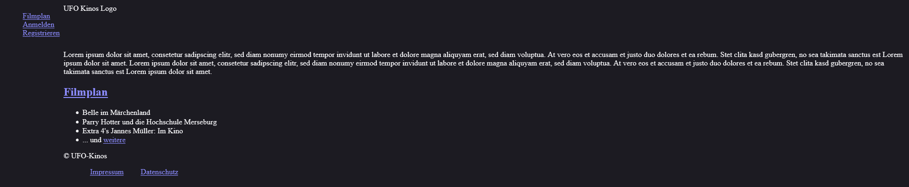

Ansicht, wie sie ein angemeldeter Benutzer sieht. 

image::./models/analysis/GUI-Entwurf/inex-renderer-user.png[Startseite, 100%, 100%, pdfwidth=100%, title= "Startseite (angemeldeter Benutzer)", align=center]

Ansicht, wie sie ein Mitarbeiter sieht. 

image::./models/analysis/GUI-Entwurf/index-renderer-staff.png[Startseite, 100%, 100%, pdfwidth=100%, title= "Startseite (Mitarbeiter)", align=center]

Ansicht, wie sie ein autorisierter Mitarbeiter sieht. 

image::./models/analysis/GUI-Entwurf/index-renderer-authorised-staff.png[Startseite, 100%, 100%, pdfwidth=100%, title= "Startseite (autorisierter Mitarbeiter)", align=center]

Ansicht, wie sie der Boss sieht. 

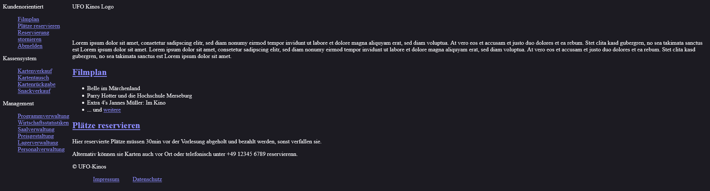

=== Registrieren
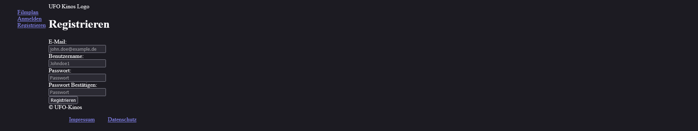

=== Anmelden
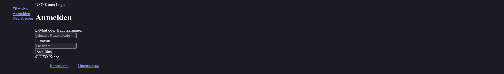

=== Programm
Programmaske, wie sie angemeldete Nutzer sehen. Für unangemeldeter Benutzer fehlen die Reservierungslinks. 

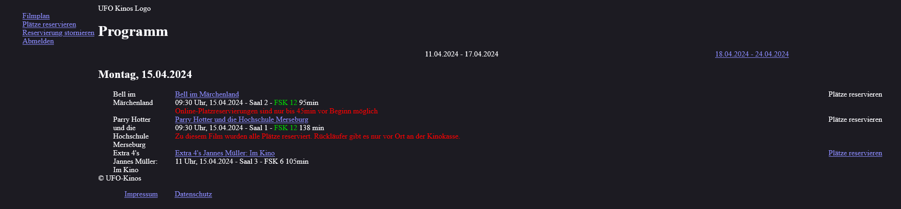

Programmaske, wie sie autorisierter Mitarbeiter sehen. Das Programm-hinzufügen-Formular wird bei Bedarf durch ein Bearbeitungs- oder Löschformular ersetzt.

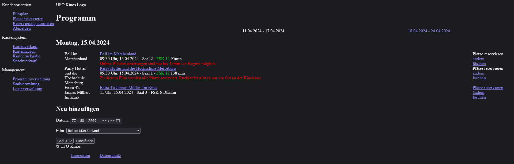

=== Tickets reservieren
Initiale Ansicht der Reservierungsmaske, wenn man "Plätze reservieren" in der Navigation anklickt.

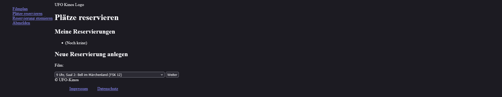

Zweite Version der Reservierungsmaske, wenn ein Film entweder auf der ersten Reservierungsmaske oder in der Programmansicht ausgewählt wurde.

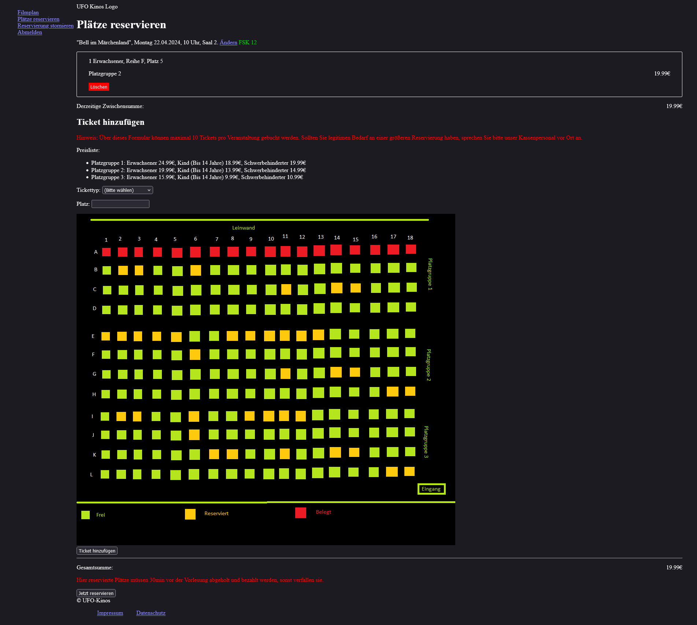

=== Reservierung stornieren
Initiale Version der Stornierungsmaske, wenn der Link "Reservierung stornieren" in der Navigation geklickt wurde.

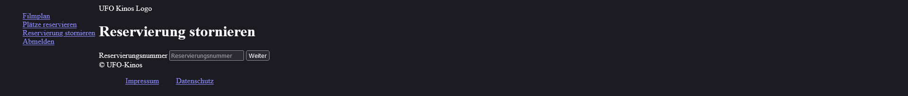

Bestätigungsabfrage beim Löschen einer Reservierung.

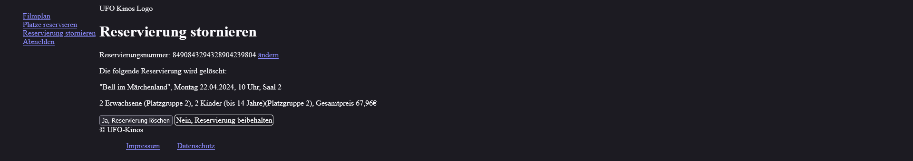

=== Verkauf
Initiale Version der Verkaufsmaske, wenn noch nichts im Warenkorb liegt. Diese wird über "Kartenverkauf" in der Navigation erreicht.

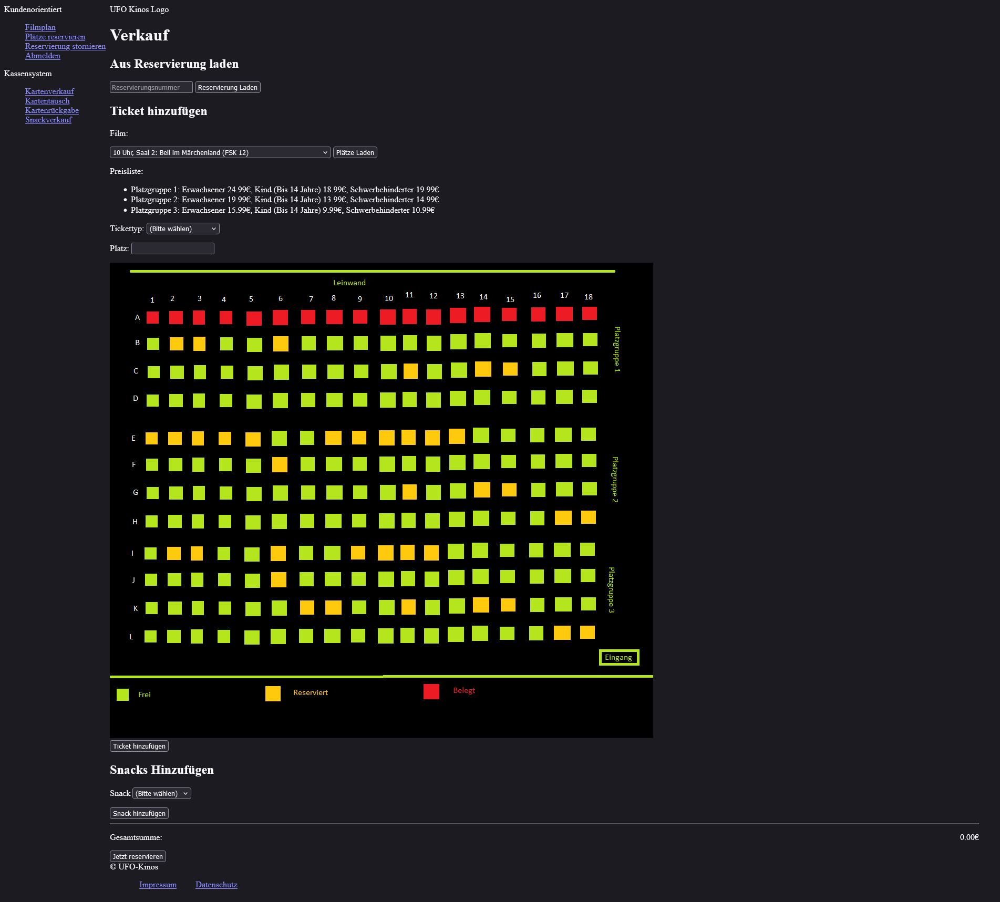

Zweite Version der Verkausmaske, wenn entweder eine Reservierung geladen oder manuell Items dem Warenkorb hinzugefügt wurden.

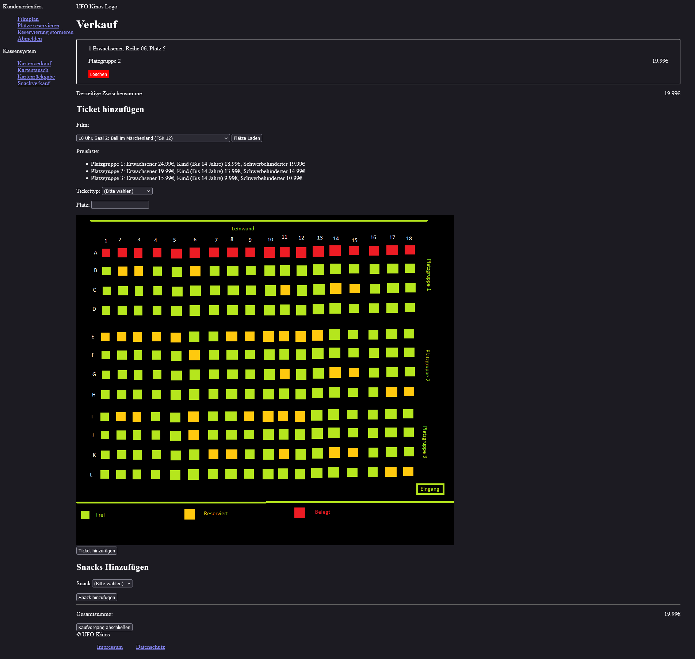

=== Tickets umtauschen
Ansicht der Kartentauschmaske. Diese wird über "Kartentausch" in der Navigation erreicht.

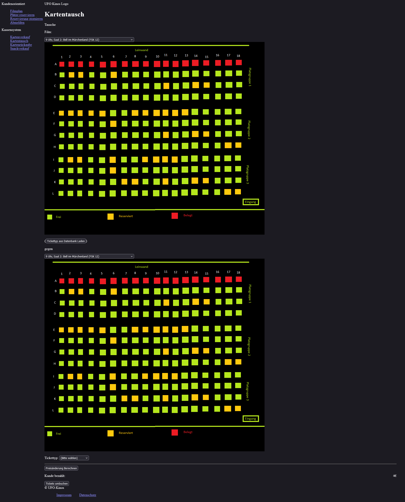

=== Tickets zurückgeben
Ansicht der Ticketrückgabemaske. Erreichbar über "Kartenrückgabe" in der Navigation.

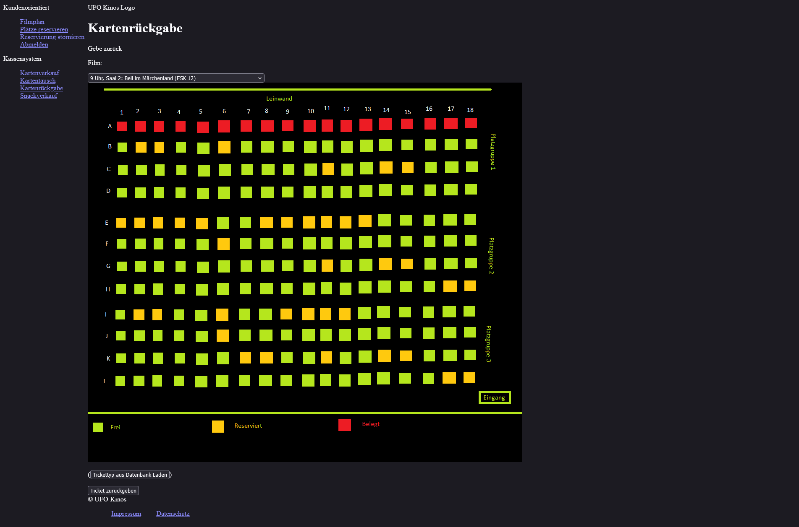

=== Saalverwaltung
Ansicht der Saalverwaltung für autorisierte Mitarbeiter. Erreichbar über "Saalverwaltung" in der Navigation. Für Kinofilme führen die Ändern- und Löschlinks zur 
Vermeidung von doppeltem Code zur Programmverwaltung.

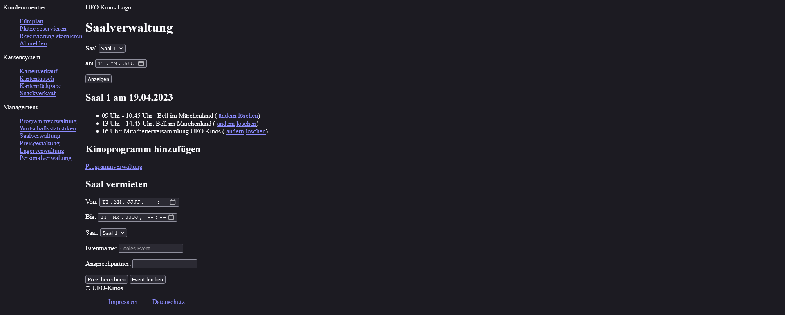

=== Personalverwaltung
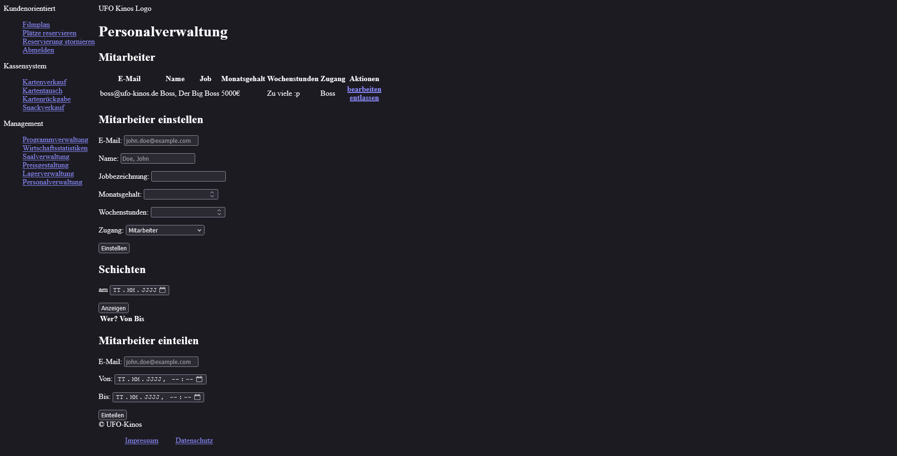

=== Lagerverwaltung
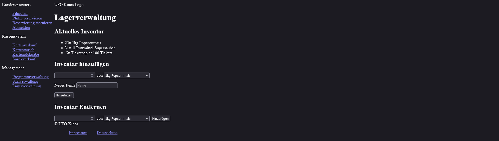

=== Preisgestaltung
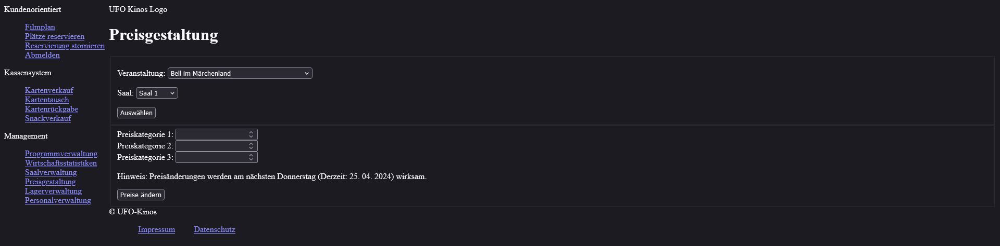

== 10. Datenmodell

=== Überblick: Klassendiagramm
UML-Analyseklassendiagramm

image::./models/analysis/Klassendiagramm/Klassendiagramm.svg[Klassendiagramm, 100%, 100%, pdfwidth=100%, title= "Klassendiagramm", align=center]

=== Klassen und Enumerationen
Dieser Abschnitt stellt eine Vereinigung von Glossar und der Beschreibung von Klassen/Enumerationen dar. Jede Klasse und Enumeration wird in Form eines Glossars textuell beschrieben. Zusätzlich werden eventuellen Konsistenz- und Formatierungsregeln aufgeführt.

// See http://asciidoctor.org/docs/user-manual/#tables
[options="header"]
|===
|Klasse/Enumeration |Beschreibung |
|Unregistered User|Repräsentation eines Menschen im Kinokontext|
|User                  |Registrierte Person            |
|Mitarbeiter       |Registrierte Person, die im Kino arbeitet und Verkäufe tätigt            |
|Autorisierter Mitarbeiter                  |Registrierte Person, die im Kino arbeitet, Verkäufe tätigt undVorstellungen udn Lager verwalten kann              |
|Chef                  |Registrierte Person, die das Kinosystem verwalten kann/Leitende Person des Kinos            |
|Bestellung                  |Der Warenkorb des Kunden vor Ort im Kino            |
|Snacks                  |Inventar der Snacks im Kino             |
|Ticket                  |Eine Instanz zu einer Vorführung für einen variablen Preis            |
|Vorführung                  |Ein Termin, an dem ein Film in einem Saal vergeführt wird            |
|Saal                  |Ein Saal des Kinos in dem Vorführungen stattfinden            |
|Platz                  |Ein Platz in einem Saal            |
|Film                  | Ein Film, der in einem Saal angezeigt werden kann und für den es Tickets gibt            |
|Event                  |Ein Sondertermin, der einen Saal für Vorführungen blockiert            |
|Umsätze|Kummulierte Werte de Tagesumsätze|
|===

== 11. Akzeptanztestfälle

[cols="1h, 4"]
|===
|ID            |[[AT0010]]<<AT0010>>
|Name          |Neukunde registriert sich
|Use Case      |<<UC0010>> Registrieren
|Vorbedingung(en)      a|Ein unregistrierter Nutzer benutzt die Webseite.
|Ablauf      a|
Der unregistrierte Nutzer drückt auf "Registrieren" auf der Webseiten Oberfläsche und trägt folgende Informationen in das Registrierungsformular ein:

- *Nutzername:* hans
- *Passwort:* passwort123
- *E-Mail:* hans_paswort123@mail.com

Anschließend drückt der Nutzer auf "Registrieren" unter dem Formular und senden damit die Informationen an das Loginsystem.
|Ergebnis(se)     a|
- Die Daten werden an das Loginsystem gesendet und geprüft ob die E-Mail oder der Nutzername bereits verwendet wurden ist
- Es wurde ein neuer Nutzer aus den übergebenen Daten erstellt und in der Datenbank des Loginsystems hinterlegt
- Die Rolle des neuen Nutzerkontos ist: "Kunde"
- Dem Nutzer ist es nun möglich sich mit seinen Login Daten auf der Webseite anzumelden
- Der Nutzer ist immer noch unangemeldet und wird auf __die Login Seite__ weitergeleitet
|===

[cols="1h, 4"]
|===
|ID            |[[AT0020]]<<AT0020>>
|Name          |Kunde meldet sich an
|Use Case      |<<UC0020>> Anmelden
|Vorbedingung(en)      a|Das Loginsystem hat existierende Nutzer.
|Ablauf      a|
Der Nutzer drückt auf "Login" auf der Webseiten Oberfläsche und trägt folgende Informationen in das Login formular ein:

- *Nutzername:* hans
- *Passwort:* passwort123

Anschließend drückt der Nutzer auf "Login" unter dem Formular und senden damit die Informationen an das Loginsystem.
|Ergebnis(se)     a|
- Der Nutzer wird als "hans" angemeldet
- Der Nutzer erhält alle Berechtigungen die der Rolle des Nutzerkontos zugeordnet sind (in diesem Fall: "Kunde")
- Der Nutzer wird auf die Startseite weitergeleitet
|===

[cols="1h, 4"]
|===
|ID            |[[AT0120]]<<AT0120>>
|Name          |Kunde Reserviert Sitzplätze
|Use Case      |<<UC0120>> Online reservieren
|Voraussetzung(en)      a|Ein angemeldeter Nutzer nutzt das Kundenportal.
|Ablauf      a|
Der Kunde drückt auf "Plätze Reservieren" auf der Webseiten Oberfläsche und fügt eine neue Reservierung zum "ReservierungsDashboard" hinzu. +
Im Reservierungsformular wählt er zunächst die Vorführung aus. Unter dem Reiter "Ticket hinzufügen" wählt der Kunde "Erwachsener" als Ticketart aus. Auf dem Sitzplan sieht er wo noch freie Plätze sind und trägt die Platznummer "B4" in das Platz Feld ein. Dann drückt er auf Ticket hinzufügen. +
Dies wiederholt er für eine Ticketreservierung mit der Ticketart "Kind" und Platz "B5". +
Um die Reservierung abzuschließen drückt der Kunde zum Schluss auf "Jetzt reservieren".
|Ergebnis(se)     a|
- Es wird überprüft ob die Plätze noch verfügbar sind
- Da die Plätze verfügbar sind werden sie geschlossen als reserviert im System eingetragen und können nun nicht mehr von anderen Kunden gebucht werden
- Der Kunde wird auf eine Reservierungsbestätigung-Seite weitergeleitet, auf der er deutlich seine Reservierungsnummer sehen kann
- Mit der Reservierungsnummer kann der Mitarbeiter an der Kasse die reservierten Tickets aufrufen und nach Bezahlung dem Kunden ausstellen
|===

[cols="1h, 4"]
|===
|ID            |[[AT0230]]<<AT0230>>
|Name          |Mitarbeiter verkauft Karten an Kunde ohne Reservierung
|Use Case      |<<UC0230>> Karten verkaufen
|Voraussetzung(en)      a|Ein angemeldeter Mitarbeiter nutzt das Kassensubsystem
|Ablauf      a|
Der Mitarbeiter drückt auf "Kartenverkauf" auf der Webseiten Oberfläche. Der Mitarbeiter wählt nun unter "Ticket hinzufügen" eine der heutigen Vorstellungen, die der Kunde besuchen möchte. +
Um nun den Sitzplan der Vorstellung angezeigt zu bekommen, drückt der Mitarbeiter auf "Plätze laden" Der Mitarbeiter wählt "Erwachsener" unter Ticketart und trägt "B4" unter Platz ein. Anschließend drückt der Mitarbeiter auf Ticket hinzufügen. +
Zuletzt beendet er den Kaufprozess mit "Kaufvorgang abschließen". +
Daraufhin öffnet sich eine finale Ansicht, in der nochmal alle Kaufinformationen und der Preis angezeigt wird. +
Der Kunde kann nun bezahlen und bei erfolgreichem Bezahlvorgang bestätigt der Mitarbeiter mit "Zahlungsvorgang abschließen".
|Ergebnis(se)     a|
- Da die Plätze verfügbar sind werden sie geschlossen als reserviert im System eingetragen und können nun nicht mehr von anderen Kunden gebucht werden
- Es werden die Daten im System für die Filmstatistik und Umsatzstatistiken aktualisiert
- Der Kunde erhält sein Ticket vom Mitarbeiter und kann damit die Vorstellung besuchen
|===

[cols="1h, 4"]
|===
|ID            |[[AT0240]]<<AT0240>>
|Name          |Mitarbeiter verkauft Snacks an Kunden
|Use Case      |<<UC0240>> Snacks verkaufen
|Voraussetzung(en)      a|Ein angemeldeter Mitarbeiter nutzt das Kassensubsystem
|Ablauf      a|
Der Mitarbeiter drückt auf "Kartenverkauf" auf der Webseiten Oberfläche. Unter dem Sitzplan drückt der Mitarbeiter auf "Snacks hinzufügen". Dann wählt der Mitarbeiter aus dem Lagerbestand "Popcorn Groß", im Popup-Menü für die Anzahl wählt er "1". Dazu wählt der Mitarbeiter "Cola Groß" aus und drückt erneut "1". +
Der Mitarbeiter speichert die Snacks im Warenkorb durch das Drücken auf den Button "Snacks fertig ausgewählt". Die ausgewählten Snacks sind jetzt darunter aufgelistet. Zuletzt beendet er den Kaufprozess mit "Kaufvorgang abschließen". +
Daraufhin öffnet sich eine finale Ansicht, in der nochmal alle Kaufinformationen und der Preis angezeigt wird.
Der Kunde kann nun bezahlen und bei erfolgreichem Bezahlvorgang bestätigt der Mitarbeiter mit "Zahlungsvorgang abschließen".
|Ergebnis(se)     a|
- Es werden die Daten im System für den Lagerbestand und Umsatzstatistiken aktualisiert
- Nach kurzer Zubereitungszeit erhält der Kunde seine Snacks
|===

//== Glossar
//Sämtliche Begriffe, die innerhalb des Projektes verwendet werden und deren gemeinsames Verständnis aller beteiligten Stakeholder essentiell ist, sollten hier aufgeführt werden.
//Insbesondere Begriffe der zu implementierenden Domäne wurden bereits beschrieben, jedoch gibt es meist mehr Begriffe, die einer Beschreibung bedürfen. +
//Beispiel: Was bedeutet "Kunde"? Ein Nutzer des Systems? Der Kunde des Projektes (Auftraggeber)?

